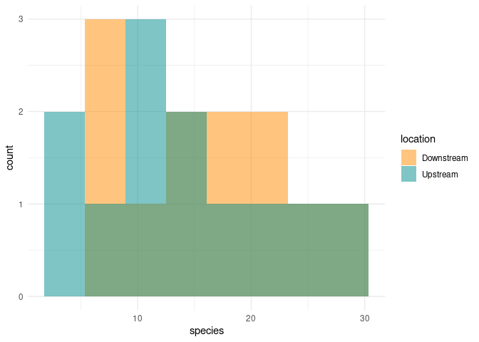
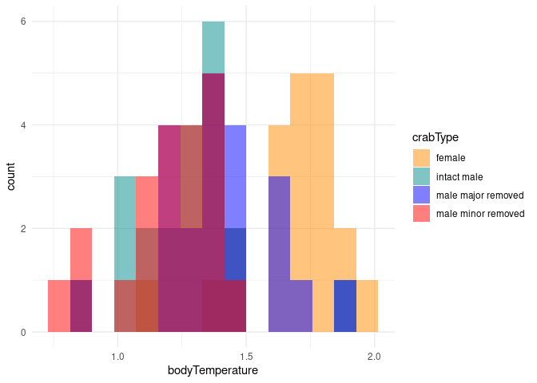

Lab 6 Comparing two means
================
2021-04-27

Researchers studying the number of electric fish species living in
various parts of the Amazon basin were interested in whether the
presence of tributaries affected the local number of electric fish
species in the main rivers (Fernandes et al. 2004).

They counted the number of electric fish species above and below the
entrance point of a major tributary at 12 different river locations.

The data is provided in your GitHub repository.

For each question below, write a sentence answering the question and
show the code you used to come up with the answer, if applicable.

``` r
# load packages -----------------------------------------------------------

library(tidyverse)
```

    ## ── Attaching packages ─────────────────────────────────────── tidyverse 1.3.1 ──

    ## ✓ ggplot2 3.3.3     ✓ purrr   0.3.4
    ## ✓ tibble  3.1.1     ✓ dplyr   1.0.5
    ## ✓ tidyr   1.1.3     ✓ stringr 1.4.0
    ## ✓ readr   1.4.0     ✓ forcats 0.5.1

    ## ── Conflicts ────────────────────────────────────────── tidyverse_conflicts() ──
    ## x dplyr::filter() masks stats::filter()
    ## x dplyr::lag()    masks stats::lag()

``` r
# read data ---------------------------------------------------------------

fish <- read_csv("chap12q19ElectricFish.csv")
```

    ## 
    ## ── Column specification ────────────────────────────────────────────────────────
    ## cols(
    ##   tributary = col_character(),
    ##   speciesUpstream = col_double(),
    ##   speciesDownstream = col_double()
    ## )

``` r
crabs <- read_csv("chap15q27FiddlerCrabFans.csv")
```

    ## 
    ## ── Column specification ────────────────────────────────────────────────────────
    ## cols(
    ##   crabType = col_character(),
    ##   bodyTemperature = col_double()
    ## )

``` r
# put data in tidy format ------------------------------------------------

fish_long <- 
  pivot_longer(fish, speciesUpstream:speciesDownstream,
               names_to = "location",
               values_to = "species") %>% 
  mutate(location = str_remove(location, c("species"))) %>% 
  print()
```

    ## # A tibble: 24 x 3
    ##    tributary location   species
    ##    <chr>     <chr>        <dbl>
    ##  1 Içá       Upstream        14
    ##  2 Içá       Downstream      19
    ##  3 Jutaí     Upstream        11
    ##  4 Jutaí     Downstream      18
    ##  5 Japurá    Upstream         8
    ##  6 Japurá    Downstream       8
    ##  7 Coari     Upstream         5
    ##  8 Coari     Downstream       7
    ##  9 Purus     Upstream        10
    ## 10 Purus     Downstream      16
    ## # … with 14 more rows

## Question A

> Test the hypothesis that the tributaries have no effect on the number
> of species of electric fish.

ANSWER

``` r
ttest_results <- t.test(formula = species ~ location, data = fish_long)
ttest_results
```

    ## 
    ##  Welch Two Sample t-test
    ## 
    ## data:  species by location
    ## t = 0.59249, df = 21.81, p-value = 0.5596
    ## alternative hypothesis: true difference in means is not equal to 0
    ## 95 percent confidence interval:
    ##  -4.587031  8.253697
    ## sample estimates:
    ## mean in group Downstream   mean in group Upstream 
    ##                 16.41667                 14.58333

## Question B

> What is the difference in the mean numbers of species between areas
> upstream and downstream of a tributary? What is the 95% confidence
> interval of this difference in means?

ANSWER

Mean\_difference = 16.41667-14.58333 =1.83334

### 95% confidence interval of Mean length difference

Upper\_limit = -4.587031

Lower\_limit = 8.253697

## Question C

> State the assumptions that you had to make to complete parts (A) and
> (B). Create a graph to assess whether one of those assumptions was
> met.

ANSWER

Assumptions:

The tributaries have no effect on the number of species of electric
fish.

The distribution of the graph was normal

``` r
fish_long %>% 
  ggplot(aes(x = species)) +
  geom_histogram(
    aes(fill = location), 
    bins = 8, 
    alpha = 0.5, 
    position = "identity"
  ) +
  scale_fill_manual(values = c("darkorange","cyan4")) +
  theme_minimal()
```

<!-- -->

## Question D

> Graph the distribution of body temperatures for each crab type

ANSWER

``` r
crabs %>% 
  ggplot(aes(x = bodyTemperature)) +
  geom_histogram(
    aes(fill = crabType), 
    bins = 15, 
    alpha = 0.5, 
    position = "identity",
    na.rm= TRUE
  ) +
  scale_fill_manual(values = c("darkorange","cyan4","blue","red")) +
  theme_minimal()
```

<!-- -->

## Question E

> Does body temperature varies among crab types? State the null and
> alternative hypothesis, conduct and ANOVA, and interpret the results.

ANSWER

Yes, the body temperature varies among crab types as it can be seen from
the distribution graph.

H0: the body temperature is equal among all crab types.

HA: At least one crab’s body temperature is different from the others.

``` r
aov_bodyTemperature_crabType <-
  aov(bodyTemperature ~ crabType, data = crabs)
aov_bodyTemperature_crabType
```

    ## Call:
    ##    aov(formula = bodyTemperature ~ crabType, data = crabs)
    ## 
    ## Terms:
    ##                 crabType Residuals
    ## Sum of Squares  2.641310  3.467619
    ## Deg. of Freedom        3        80
    ## 
    ## Residual standard error: 0.2081952
    ## Estimated effects may be unbalanced
    ## 1 observation deleted due to missingness

``` r
summary(aov_bodyTemperature_crabType)
```

    ##             Df Sum Sq Mean Sq F value Pr(>F)    
    ## crabType     3  2.641  0.8804   20.31  7e-10 ***
    ## Residuals   80  3.468  0.0433                   
    ## ---
    ## Signif. codes:  0 '***' 0.001 '**' 0.01 '*' 0.05 '.' 0.1 ' ' 1
    ## 1 observation deleted due to missingness
